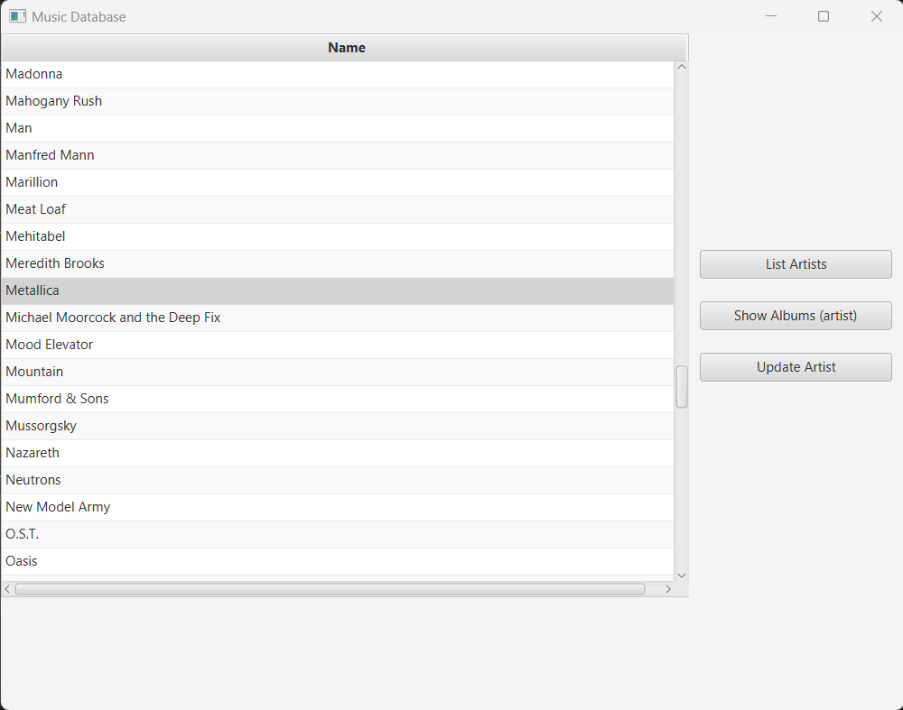

# Music DB - JavaFX 

## Description

A Music Database application built with Java with a JavaFX GUI, and SQLite database using the JBDC driver.
This project was part of a Java Tutorial on Udemy.

### App Screenshot

## Table of Contents

- [Installation](#installation)
- [Usage](#usage)
- [License](#license)
- [Contributing](#contributing)
- [Tests](#tests)
- [Questions](#questions)

## Installation

run in JavaFX

## Usage

Upon opening application you should see a list of artists.  Select an artist and click the Show Albums button to show albums by that artist.  Clicking the List Artists button will show the full list of artists again.

## License
This application is covered under the MIT License.
 For more information: https://opensource.org/licenses/MIT

## Contributing
N/A

## Tests
N/A

## Questions
Contact Info 
GitHub user name: BillStephens2022 
Link to GitHub profile: https://github.com/BillStephens2022 
Email: stephensbill17@gmail.com